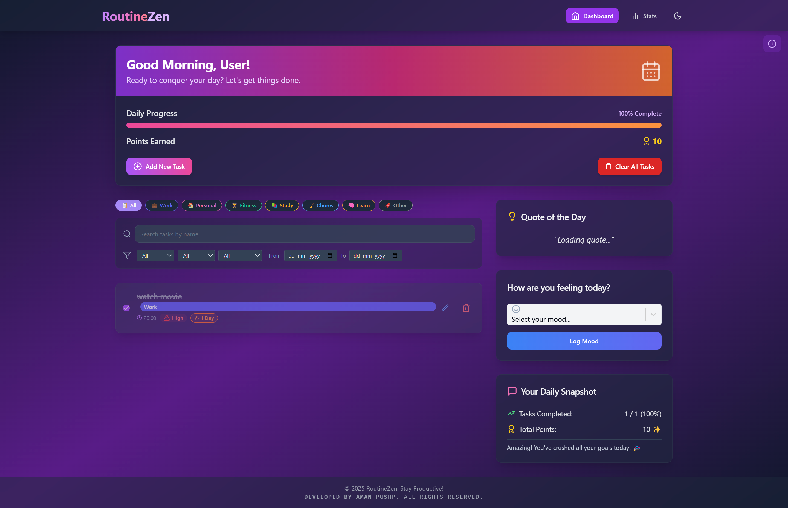

# RoutineZen - Daily Routine Tracker 🚀

A cutting-edge, futuristic web application for tracking and managing daily routines. Built with React and powered by a robust tech stack, RoutineZen combines sleek design with smooth animations to create an immersive user experience.

## 🌐 Live Demo

Experience RoutineZen in action:
- **Live Application:** [RoutineZen Demo](https://routinezen.netlify.app/)


> 💡 **Note:** The demo account has limited functionality. Create your own account to access all features.

## ✨ Key Features

- 🌟 Futuristic UI with glassmorphism and neumorphism effects
- 🎭 Smooth page transitions and micro-interactions
- 📊 Interactive data visualization with charts and heatmaps
- 🎯 Habit tracking with real-time progress animations
- 📱 Responsive design with fluid animations
- 🎨 Modern UI with Framer Motion animations
- 📈 Progress analytics with animated insights
- 📤 Export functionality with animated transitions
- 🔄 Real-time progress updates with motion effects
- 📅 Calendar integration with smooth interactions
- 🎯 Goal setting with progress animations
- 📊 Customizable dashboard with dynamic layouts

## 🛠️ Tech Stack

- **Frontend Framework:** React 18
- **Build Tool:** Vite
- **Styling:** Tailwind CSS
- **UI Components:** Radix UI
- **Animation & Motion:**
  - Framer Motion
  - CSS Transitions
  - Spring Animations
- **Charts & Visualization:**
  - Chart.js
  - React Chart.js 2
  - Recharts
  - React Calendar Heatmap
- **PDF Generation:** jsPDF
- **Routing:** React Router DOM

## 🎨 Design Features

- **Motion Design**
  - Smooth page transitions
  - Micro-interactions
  - Loading animations
  - Progress indicators
  - Hover effects
  - Scroll animations

- **Visual Elements**
  - Glassmorphism effects
  - Neumorphic components
  - Gradient overlays
  - Dynamic shadows
  - Responsive layouts
  - Dark/Light mode

## 📸 Screenshots

### Dashboard


### Analytics & Insights


## Project Structure

```
src/
├── components/     # Reusable UI components
├── context/       # React context providers
├── hooks/         # Custom React hooks
├── lib/           # Utility functions and helpers
├── pages/         # Page components
├── App.jsx        # Main application component
├── main.jsx       # Application entry point
└── index.css      # Global styles
```

## Getting Started

### Prerequisites

- Node.js (Latest LTS version recommended)
- npm or yarn
- Git

### Installation

1. Clone the repository:
   ```bash
   git clone https://github.com/AMANPUSHP23/RoutineZen.git
   cd RoutineZen
   ```

2. Install dependencies:
   ```bash
   npm install
   # or
   yarn install
   ```

3. Configure environment variables:
   Create a `.env` file in the root directory and add any necessary environment variables:
   ```env
   VITE_API_URL=your_api_url_here
   ```

4. Start the development server:
   ```bash
   npm run dev
   # or
   yarn dev
   ```

5. Open [http://localhost:5173](http://localhost:5173) in your browser.

### Available Scripts

- `npm run dev` - Start development server
- `npm run build` - Build for production
- `npm run preview` - Preview production build
- `npm run lint` - Run ESLint

### Development Guidelines

1. **Code Style**
   - Follow ESLint configuration
   - Use functional components with hooks
   - Implement proper error handling
   - Write meaningful comments

2. **Component Structure**
   - Keep components small and focused
   - Use proper prop types
   - Implement error boundaries
   - Follow atomic design principles

3. **State Management**
   - Use React Context for global state
   - Implement proper loading states
   - Handle errors gracefully
   - Use custom hooks for reusable logic

## Contributing

1. Fork the repository
2. Create your feature branch (`git checkout -b feature/AmazingFeature`)
3. Commit your changes (`git commit -m 'Add some AmazingFeature'`)
4. Push to the branch (`git push origin feature/AmazingFeature`)
5. Open a Pull Request

## License

This project is licensed under the MIT License - see the [LICENSE](LICENSE) file for details.

## Created By

👨‍💻 **Aman Pushp**

## Acknowledgments

- [Radix UI](https://www.radix-ui.com/) for accessible UI components
- [Tailwind CSS](https://tailwindcss.com/) for utility-first CSS
- [Chart.js](https://www.chartjs.org/) for data visualization
- [Vite](https://vitejs.dev/) for the blazing fast build tool
- [React](https://reactjs.org/) for the amazing UI library
- [Framer Motion](https://www.framer.com/motion/) for beautiful animations 